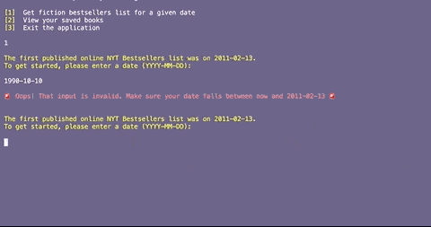
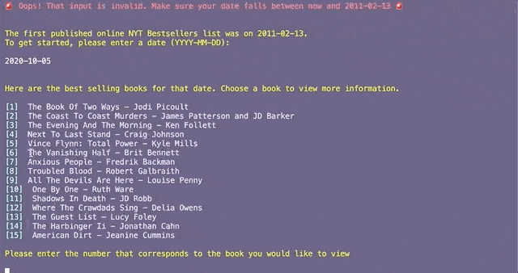
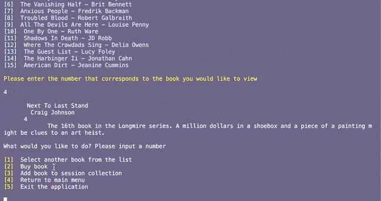
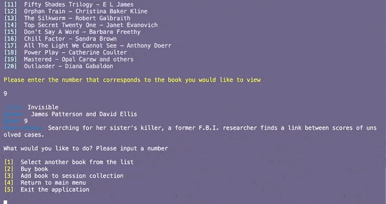

# NytCli

Welcome to the New York Times Fiction Bestsellers CLI gem! In this application, you are able to view the NYT bestselling fiction books for a given date, view more information about the books on the list for each date, and save books that interest you to a collection. 

Welcome to your new gem! In this directory, you'll find the files you need to be able to package up your Ruby library into a gem. Put your Ruby code in the file `lib/nyt_cli`. To experiment with that code, run `bin/console` for an interactive prompt.


## Installation

<!-- Add this line to your application's Gemfile:

```ruby
gem 'nyt_cli'
``` -->

<!-- And then execute:

    $ bundle install -->

To install, run:

    $ gem install nyt_cli

## Usage

Use NytCLI to retrieve information about fiction books on the New York Times Bestsellers list for a given date! 

Get a list of books that appear on the New York Times Bestsellers list for a given date



Get more information about any given book on a list you search for 



Launch a link to buy any given book straight from within the application



Save and view books to an easily accessible collection



Happy book hunting! 📚 


## Development

After checking out the repo, run `bin/setup` to install dependencies. Then, run `rake spec` to run the tests. You can also run `bin/console` for an interactive prompt that will allow you to experiment.

To install this gem onto your local machine, run `bundle exec rake install`. To release a new version, update the version number in `version.rb`, and then run `bundle exec rake release`, which will create a git tag for the version, push git commits and the created tag, and push the `.gem` file to [rubygems.org](https://rubygems.org).

## Contributing

Bug reports and pull requests are welcome on GitHub at https://github.com/[USERNAME]/nyt_cli.

## License

The gem is available as open source under the terms of the [MIT License](https://opensource.org/licenses/MIT).
